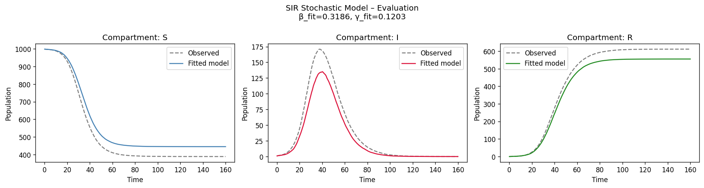

# SIR Stochastic Epidemic Simulation

A Python implementation of the **SIR (Susceptible–Infected–Recovered)** epidemic model using exact stochastic simulation via the **Gillespie algorithm**.  The project includes a reusable model class, a training pipeline that fits model parameters to observed data, and an evaluation suite with standard metrics and plots.

---

## Table of Contents

1. [Background](#background)
2. [Project Structure](#project-structure)
3. [Installation](#installation)
4. [Quick Start](#quick-start)
5. [Module Reference](#module-reference)
   - [SIRStochasticModel](#sirstochasticmodel)
   - [train\_evaluate.py](#train_evaluatepy)
6. [Training & Evaluation](#training--evaluation)
7. [Results](#results)
8. [Notebook](#notebook)

---

## Background

The SIR model partitions a population of size *N* into three compartments:

| Symbol | Meaning |
|--------|---------|
| **S** | Susceptible – can catch the disease |
| **I** | Infected – currently infectious |
| **R** | Recovered – immune (or removed) |

### Stochastic equations (Gillespie algorithm)

Unlike deterministic ODEs, the Gillespie algorithm captures the **inherent randomness** of disease transmission at the individual level.  Two competing Poisson processes drive the dynamics:

| Event | Rate |
|-------|------|
| S → I (infection) | β · S · I / N |
| I → R (recovery)  | γ · I |

At each step, the time to the next event is drawn from an exponential distribution and the event type is chosen proportionally to its rate.

---

## Project Structure

```
SIR/
├── sir_model.py                               # SIRStochasticModel class
├── train_evaluate.py                          # Training & evaluation pipeline
├── simulate_epidemic_for_stochastic_equations.ipynb  # Interactive notebook
├── sir_model.pkl                              # Saved trained model (pickle)
├── sir_model.json                             # Saved trained model (JSON)
├── evaluation_plot.png                        # Evaluation visualisation
├── evaluation_metrics.json                    # Per-compartment metrics
└── README.md
```

---

## Installation

Python 3.10+ is required.

```bash
pip install numpy scipy matplotlib
```

---

## Quick Start

```python
from sir_model import SIRStochasticModel

# Create a model
model = SIRStochasticModel(N=1000, beta=0.3, gamma=0.1)

# Run a single stochastic simulation
result = model.simulate(S0=999, I0=1, R0=0, T_max=160, seed=42)

# Average over 50 stochastic runs
mean_traj = model.simulate_mean(S0=999, I0=1, R0=0, T_max=160, n_runs=50)

# Save and reload
model.save("sir_model.pkl")
model.save_json("sir_model.json")

loaded = SIRStochasticModel.load("sir_model.pkl")
```

---

## Module Reference

### SIRStochasticModel

Defined in `sir_model.py`.

| Method | Description |
|--------|-------------|
| `__init__(N, beta, gamma)` | Initialise model parameters |
| `simulate(S0, I0, R0, T_max, seed)` | Run one Gillespie simulation; returns `dict(time, S, I, R)` |
| `simulate_mean(S0, I0, R0, T_max, n_runs, n_timepoints, seed)` | Average *n_runs* trajectories on a regular time grid |
| `save(path)` | Save model to a pickle file |
| `save_json(path)` | Save model to a JSON file |
| `load(path)` *(classmethod)* | Load model from a pickle file |
| `load_json(path)` *(classmethod)* | Load model from a JSON file |

### train\_evaluate.py

End-to-end pipeline:

| Function | Description |
|----------|-------------|
| `generate_observed_data()` | Simulate "ground truth" epidemic data |
| `train(obs)` | Fit β and γ using Nelder-Mead optimisation; returns a fitted `SIRStochasticModel` |
| `evaluate(fitted_model, obs, plot)` | Compute MSE / RMSE / MAE; optionally save a comparison plot |

---

## Training & Evaluation

```bash
python train_evaluate.py
```

The script:

1. **Generates observed data** – runs 100 stochastic simulations with the true parameters (β=0.3, γ=0.1) and computes the mean trajectory.
2. **Trains** – uses Nelder-Mead optimisation to recover β and γ from the observations, starting from an initial guess of β=0.4, γ=0.15.
3. **Evaluates** – reports MSE, RMSE, and MAE for each compartment and saves `evaluation_plot.png`.
4. **Saves** the fitted model to `sir_model.pkl` and `sir_model.json`.

### Sample output

```
Step 1 – Generating observed data
  β_true=0.3, γ_true=0.1, N=1000
  Generated 100 trajectories – peak I ≈ 171.0

Step 2 – Training (parameter fitting via Nelder-Mead)
  Initial guess: β=0.4, γ=0.15
  Optimisation converged:
  β_fit=0.3186  (true 0.3)
  γ_fit=0.1203  (true 0.1)
  R0_fit=2.647  (true 3.0)

Step 3 – Evaluation
  Compartment         MSE          RMSE         MAE
  S             2769.89       52.63        49.29
  I              235.05       15.33         9.34
  R             1990.37       44.61        39.96
```

---

## Results

The evaluation plot below compares the mean trajectory of the **fitted model** (solid lines) against the **observed data** (dashed grey lines) for all three compartments:



---

## Notebook

Open `simulate_epidemic_for_stochastic_equations.ipynb` for an interactive walkthrough covering:

- Raw Gillespie simulation and plotting
- Using the `SIRStochasticModel` class
- Computing mean trajectories over multiple runs
- Saving and loading a model
- Running the training pipeline
- Viewing the evaluation results inline
